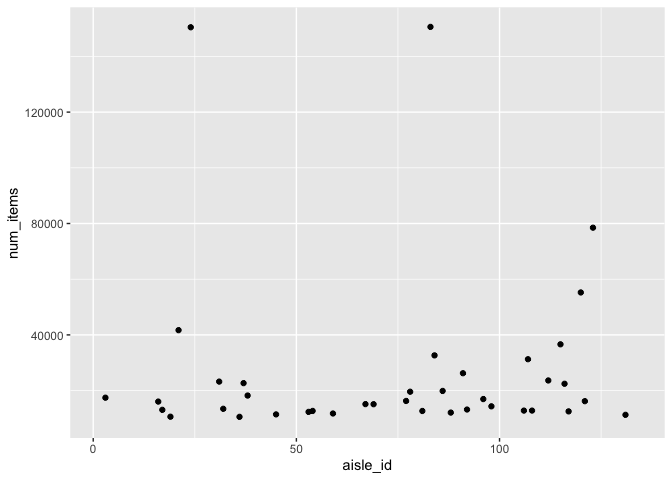

p8105_hw3_nl2835
================
Nancy Le
2023-10-08

``` r
library(tidyverse)
library(p8105.datasets)
library(ggridges)
data("instacart")
```

### Problem 1

The Instacart dataset has 1384617 observations and 15 variables, which
include `order_id`, `product_id`, the `user_id`, `product_name`s, and
which location of the supermarket the products were found (as in, the
`department` and `aisle`).

User IDs ranged from 1 to 206209.

``` r
num_aisles <- instacart |> 
  select(aisle) |> 
  distinct() |> 
  nrow()

print(num_aisles)
## [1] 134
```

There are 134 aisles.

``` r
count_items_aisle <- instacart |> 
 group_by(aisle_id) |> 
 count() |> 
  arrange(desc(n))
```

The most items are ordered from Aisle `83` .

``` r
count_items_aisle |>
  rename(num_items = n) |> 
  ggplot(aes(x = aisle_id, y = num_items)) + geom_point() + ylim(10000, NA)
## Warning: Removed 95 rows containing missing values (`geom_point()`).
```

<!-- -->
