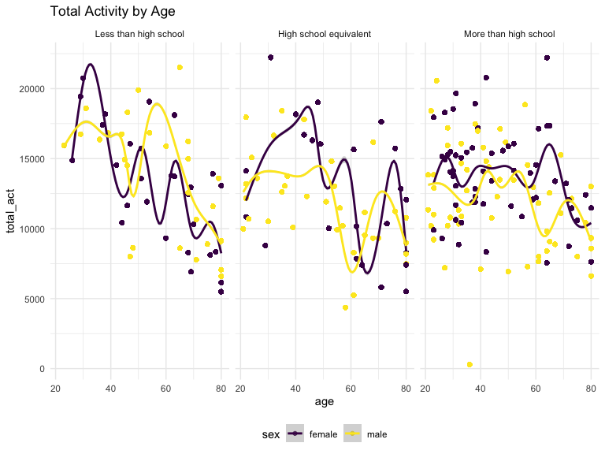

p8105_hw3_nl2835
================
Nancy Le
2023-10-11

## Problem 2

``` r
data("brfss_smart2010")
```

``` r
brfss = brfss_smart2010 |> 
  janitor::clean_names() |> 
  filter(topic=="Overall Health") |> 
  drop_na(response) |> 
  mutate(response = as_factor(response)) |> 
  mutate(locationdesc = substring(locationdesc, 5)) |> 
  rename(county = locationdesc, state = locationabbr, response_prevalence = data_value)
```

``` r
states_seven_2002 = brfss |> 
  filter(year=="2002") |> 
  group_by(state) |> 
  summarize(unique_counties = n_distinct(county)) |> 
  filter(unique_counties >= 7)
```

``` r
states_seven_2010 = brfss |> 
  filter(year=="2010") |> 
  group_by(state) |> 
  summarize(unique_counties = n_distinct(county)) |> 
  filter(unique_counties >= 7)
```

#### 2002 - States \>= 7 Locations

``` r
library(knitr)
kable(states_seven_2002)
```

| state | unique_counties |
|:------|----------------:|
| CT    |               7 |
| FL    |               7 |
| MA    |               8 |
| NC    |               7 |
| NJ    |               8 |
| PA    |              10 |

#### 2010 - States \>= 7 Locations

``` r
kable(states_seven_2010)
```

| state | unique_counties |
|:------|----------------:|
| CA    |              12 |
| CO    |               7 |
| FL    |              41 |
| MA    |               9 |
| MD    |              12 |
| NC    |              12 |
| NE    |              10 |
| NJ    |              19 |
| NY    |               9 |
| OH    |               8 |
| PA    |               7 |
| SC    |               7 |
| TX    |              16 |
| WA    |              10 |

``` r
excellent = brfss |> 
  filter(response == "Excellent") |> 
  group_by(state, year) |> 
  mutate(mean_response_prevalence = mean(response_prevalence, na.rm = TRUE)) |> 
  select(year, state, mean_response_prevalence)
```

``` r
excellent |> 
  ggplot(
  aes(x = year, y = mean_response_prevalence, group = state, color = state)) + geom_line() +
  labs(
    title = "Spaghetti Plot of Mean Response Prevalence by State", 
    x = "Year", 
    y = "Response Prevalence"
  )
```


``` r
nytwopanel = brfss |> 
  filter(year == 2006 | year == 2010) |> 
  filter(state == "NY")  |>  
  group_by(state, year, county) 
```

``` r
ggplot(nytwopanel, aes(x = response_prevalence, color = response)) + 
  geom_density(alpha = .5) + 
  facet_grid(. ~ year) +
  ggtitle("Response Distribution in NY")
```


``` r
ggplot(nytwopanel, aes(y = response_prevalence, x = response, color = county, group = county)) + 
  geom_point(alpha = .5) + 
  facet_grid(year ~ .) + 
  ggtitle("Response Distribution by County")
```


## Problem 3

``` r
mims_demo = 
  read_csv("./nhanes_covar.csv", skip = 4)
```

    ## Rows: 250 Columns: 5
    ## ── Column specification ────────────────────────────────────────────────────────
    ## Delimiter: ","
    ## dbl (5): SEQN, sex, age, BMI, education
    ## 
    ## ℹ Use `spec()` to retrieve the full column specification for this data.
    ## ℹ Specify the column types or set `show_col_types = FALSE` to quiet this message.

``` r
mims_acc = 
  read_csv("./nhanes_accel.csv") |> 
  pivot_longer(
    min1:min1440, 
    names_to = "minute",
    values_to = "MIMS_value") |> 
  mutate(
    minute = sub("min", "", minute)
  ) 
```

    ## Rows: 250 Columns: 1441
    ## ── Column specification ────────────────────────────────────────────────────────
    ## Delimiter: ","
    ## dbl (1441): SEQN, min1, min2, min3, min4, min5, min6, min7, min8, min9, min1...
    ## 
    ## ℹ Use `spec()` to retrieve the full column specification for this data.
    ## ℹ Specify the column types or set `show_col_types = FALSE` to quiet this message.

``` r
merged_mims = 
  inner_join(mims_acc, mims_demo) |> 
  filter(age>=21) |>
  na.omit() |> 
  mutate(
    sex = case_when(
      sex == 2 ~ "female",
      sex == 1 ~ "male"), 
    minute = as.numeric(minute), 
    education = case_when (
      education == 1 ~ "Less than high school",
      education == 2 ~ "High school equivalent",
      education == 3 ~ "More than high school")) |> 
  mutate(
    education = factor(education, levels = c("Less than high school", "High school equivalent", "More than high school")))  
```

    ## Joining with `by = join_by(SEQN)`

``` r
merged_mims |> 
  group_by(education, sex) |> 
  summarize(count = n_distinct(SEQN)) |> 
  knitr::kable(digits = 2)
```

    ## `summarise()` has grouped output by 'education'. You can override using the
    ## `.groups` argument.

| education              | sex    | count |
|:-----------------------|:-------|------:|
| Less than high school  | female |    28 |
| Less than high school  | male   |    27 |
| High school equivalent | female |    23 |
| High school equivalent | male   |    35 |
| More than high school  | female |    59 |
| More than high school  | male   |    56 |

``` r
ggplot(merged_mims, aes(x = age, color = sex, group = sex)) + 
  geom_histogram(alpha = .5, binwidth=1) + 
  ggtitle("Age Distribution by Sex") 
```


Comment on histogram

``` r
mims_tot = merged_mims |>  
  group_by(SEQN, sex) |> 
  mutate(
    total_act = sum(MIMS_value) 
  ) 
```

``` r
mims_tot |> 
  group_by(sex) |> 
  ggplot(aes(x = age, y = total_act, color = sex)) +
  geom_point() + 
  geom_smooth() +
  facet_wrap(. ~ education) + 
  ggtitle("Total Activity by Age")
```

    ## `geom_smooth()` using method = 'gam' and formula = 'y ~ s(x, bs = "cs")'


